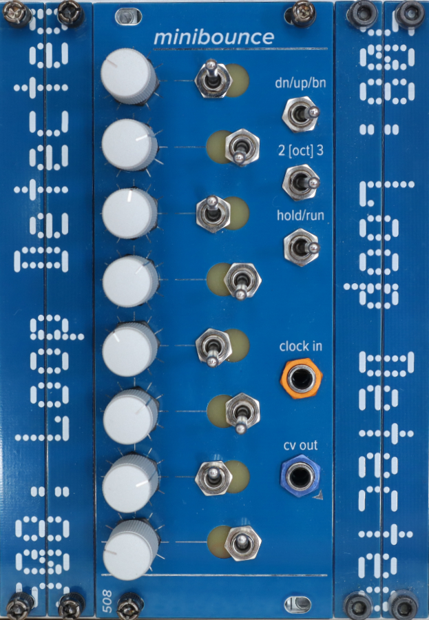

# Minibounce Sequencer

A narrower 10HP edition of the 8-step sequencer with a toggle switch interface. The top-right switch selects up / down / or bounce mode. In up or down mode, flipping any two of the middle vertical (staggered) row of switches will cause the sequencer to skip the steps between them (either between them on the inside, or between them on the outside, depending).

In bounce mode, any flipped switch (indicated by a red-orange LED) will cause the sequencer to reverse direction when it hits it.

There's a toggle to select ~2 octave or ~3 octave range, and a hold/run toggle.

There is an expansion bus on the back for driving the optional 8-step trigger sequencer, and the optional variable gates sidecar.

This module, like many of my modules, uses 2mm-pitch male/female headers. Be sure you order/use the right thing!

Most ICs are SOIC 8/14/16; all passives are 0805. The BOMs prefixed with `fixed` are easier to read; the others can be used along with the Pick-and-place and gerber files to order PCBs.
